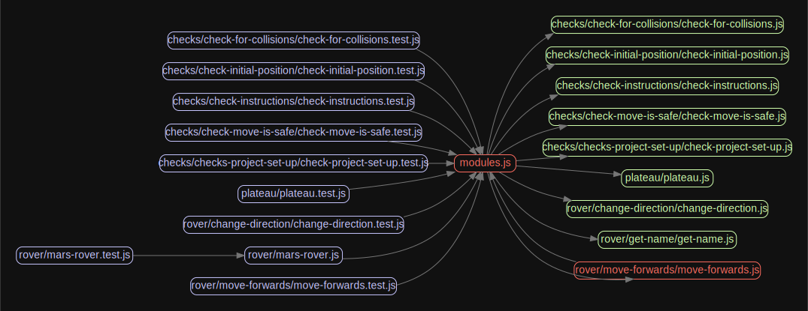

# Space Exploration: Mars Rover technical Challenge

The problem below requires some kind of input. You are free to implement any mechanism for feeding input into your solution (for example, using hard coded data within a unit test). You should provide sufficient evidence that your solution is complete by, as a minimum, indicating that it works correctly against the supplied test data.

We highly recommend using a unit testing framework. Even if you have not used it before, it is simple to learn and incredibly useful. The code you write should be of productionquality, and most importantly, it should be code you are proud of.

# MARS ROVERS

A squad of robotic rovers are to be landed by NASA on a plateau on Mars. This plateau, which is curiously rectangular, must be navigated by the rovers so that their on board cameras can get a complete view of the surrounding terrain to send back to Earth. 

A rover's position is represented by a combination of an x and y co-ordinates and a letter representing one of the four cardinal compass points. The plateau is divided up into a grid to simplify navigation. An example position might be 0, 0, N, which means the rover is in the bottom left corner and facing North. 

In order to control a rover, NASA sends a simple string of letters. The possible letters are 'L', 'R' and 'M'. 'L' and 'R' makes the rover spin 90 degrees left or right respectively, without moving from it's current spot.'M' means move forward one grid point, and maintain the same heading. 

Assume that the square directly North from (x, y) is (x, y+1).

## Input: 

The first line of input is the upper-right coordinates of the plateau, the lower-left coordinates are assumed to be 0,0. The rest of the input is information pertaining to the rovers that have been deployed. 

Each rover has two lines of input. 

The first line gives the rover's position, and the second line is a series of instructions telling the rover how to explore the plateau. 

The position is made up of two integers and a letter separated by spaces, corresponding to the x and y co-ordinates and the rover's orientation. Each rover will be finished sequentially, which means that the second rover won't start to move until the first one has finished moving.

## Output:

The output for each rover should be its final co-ordinates and heading.

## Test Input:

Upper-right coordinate of the plateau: 5 5

Lower-left coordinate assumed to be: 0 0

-------------------------------------------

Rover 1's starting position: 1 2 N

Rover 1's instructions: LMLMLMLMM

-------------------------------------------

Rover 2's starting position: 3 3 E

Rover 2's instructions: MMRMMRMRRM

## Expected Output:

Rover 1's end position: 1 3 N 

Rover 2's end position: 5 1 E


-------------------------------------------

## The Solution:

- This solution returns the correct final positions of Rovers 1 and 2 

- This solution checks instructions and initial co-ordinates sent from Ground Control are valid before embarking on a rover journey

- This solution checks for potential collisions with other Rovers

- This solution checks and throws errors if a Rover is about to fall off the edge of the plateau

- This solution works for different sized plateaus

- This solution gives each Rover a cool name like so Rovers can be easily identified 

- This solution includes a package to check for Circular dependencies (there are none now, but it was a fun learning along the way and the images it produces are really cool - nice one [madge!](https://www.npmjs.com/package/madge))

-------------------------------------------


# Notes to self:

- Want to figure out why tempalate literal not working in exception in check-move-safe

- Check get-final-position test mock as don't think it's doing anything

- Want to make it work for a circular or non-rectangular shape

- Need to write read me

- <del>Need to include image of Circular Dependency issue detected by James and dispalyed by Madge</del>✅

- <del>Need to add madge to dev dependencies</del>✅

- Add scribblings / ideas image

- Add lessons learnt

- <del>Add how to run</del>✅

- Add more rovers, initial positions and plateaus to test - create test for this?


## How to Run this project:

1. Clone this repo to your local computer:

```
git clone https://github.com/EllieJudge/space-exploration.git
```

2. Install the dependencies:

```
npm install
```

3. Run the tests:

```
npm test
```

Check your console, you will see a list of all the Rovers currently on Mars (in this project)!

## Madge

List dependencies from all *.js files found in this directory:

```
madge space-exploration
```

To check for Circular dependencies before take-off, you can run:

```
madge --circular space-exploration
```

To generate a graph of this projects dependencies you will need to install GraphViz. 
Then you can run:

```
madge --image graph.svg space-exploration
```

This will save an SVG file in the project directory (like the image below). 
To open this and view it in the browser you can run:

```
open graph.svg
```





